# Steganography System — Diagrams

## 1. Overall System Flow

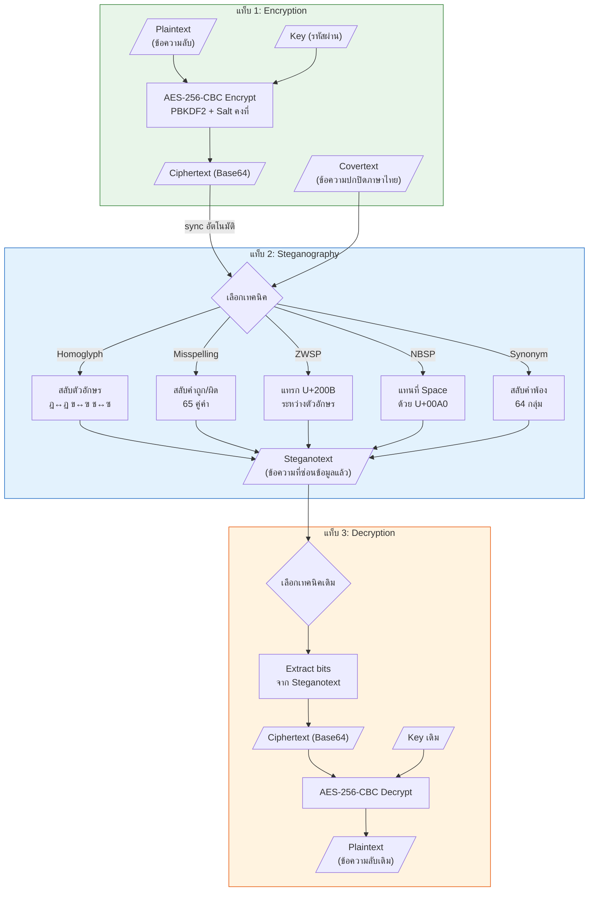

---

## 2. Payload Format (ใช้ร่วมกันทุกเทคนิค)

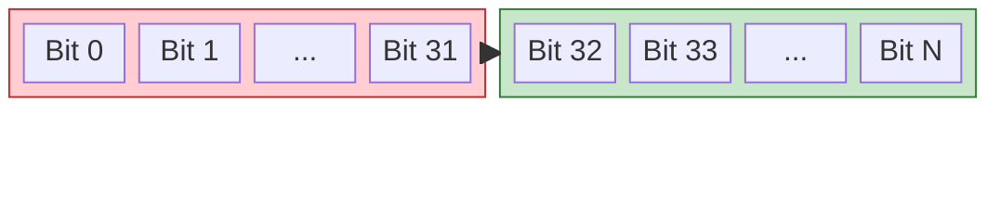

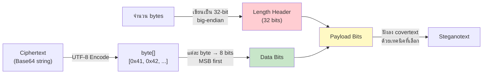

**ตัวอย่าง:** Ciphertext = `"AB"` (2 bytes)

| ส่วน | Bits | จำนวน |
|------|------|-------|
| Header | `00000000 00000000 00000000 00000010` | 32 bits |
| Data 'A' (0x41) | `01000001` | 8 bits |
| Data 'B' (0x42) | `01000010` | 8 bits |
| **รวม** | | **48 bits** |

---

## 3. Homoglyph Technique

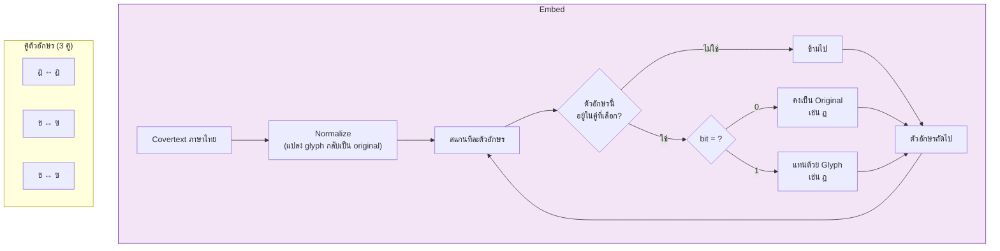

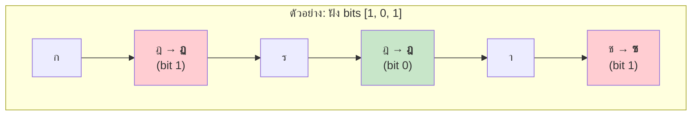

**ความจุ:** จำนวนตัวอักษร ฎ, ข, ช (+ glyph) ที่ปรากฏใน covertext

---

## 4. Misspelling Technique

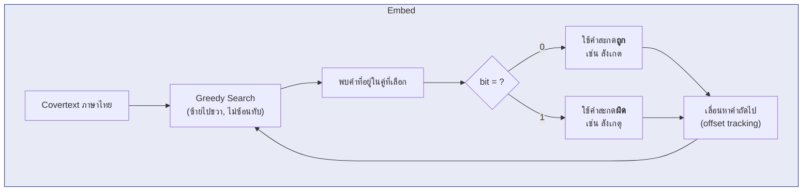

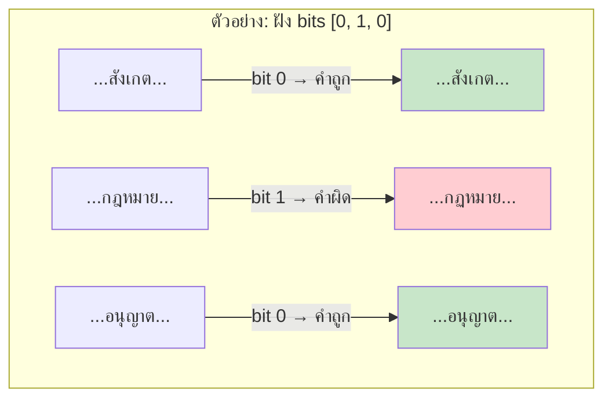

**ความจุ:** จำนวนคำจากคู่ที่เลือกที่ปรากฏใน covertext (65 คู่คำ)

---

## 5. ZWSP (Zero-Width Space) Technique

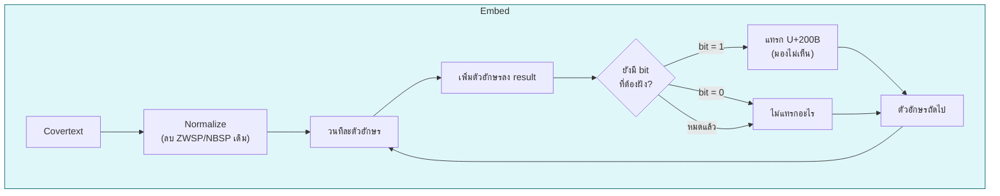

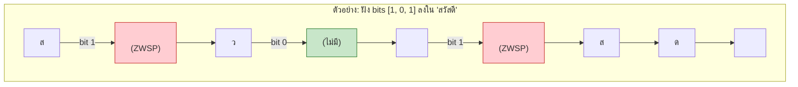

**ความจุ:** `covertext.Length - 1` bits (ช่องระหว่างตัวอักษรทุกคู่)

---

## 6. NBSP (Non-Breaking Space) Technique

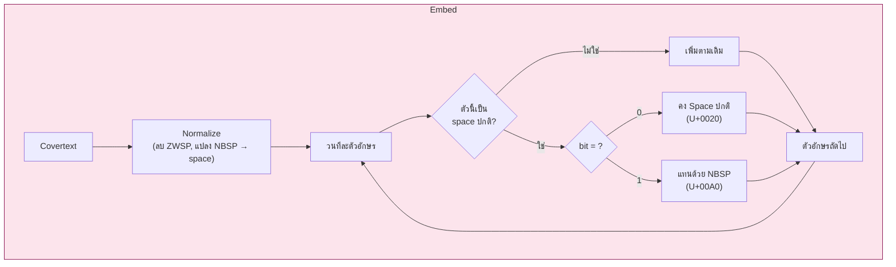

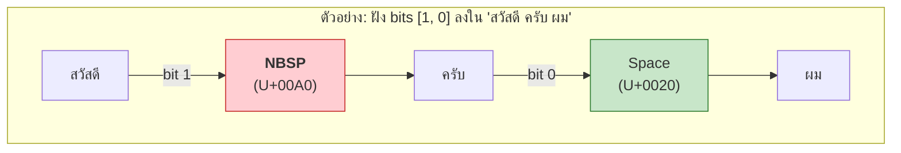

**ความจุ:** จำนวน space ที่มีใน covertext

---

## 7. Synonym Technique

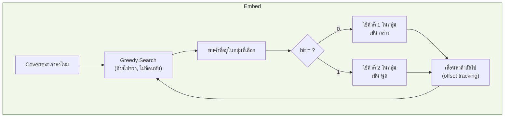

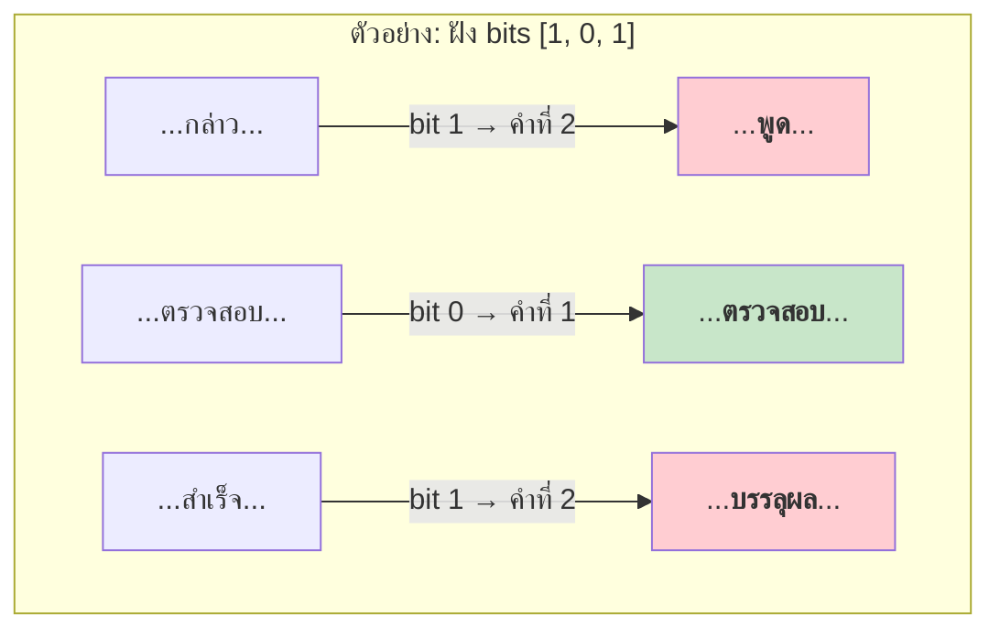

**ความจุ:** จำนวนคำพ้องจากกลุ่มที่เลือกที่ปรากฏใน covertext (64 กลุ่ม)

---

## 8. AES-256-CBC Encryption Flow

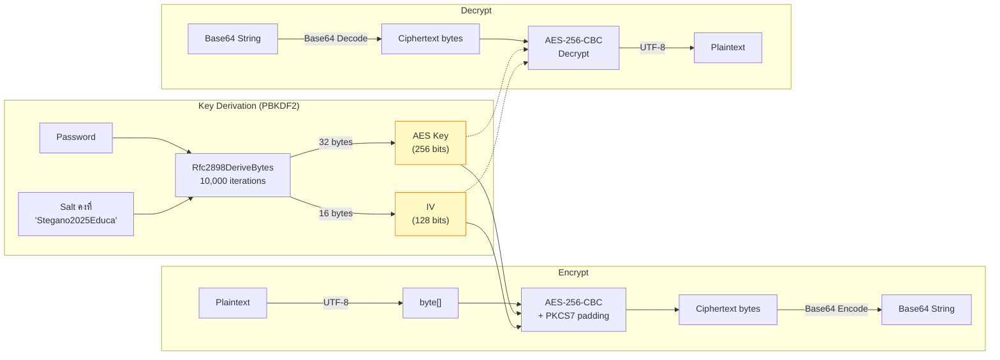

---

## 9. เปรียบเทียบ 5 เทคนิค

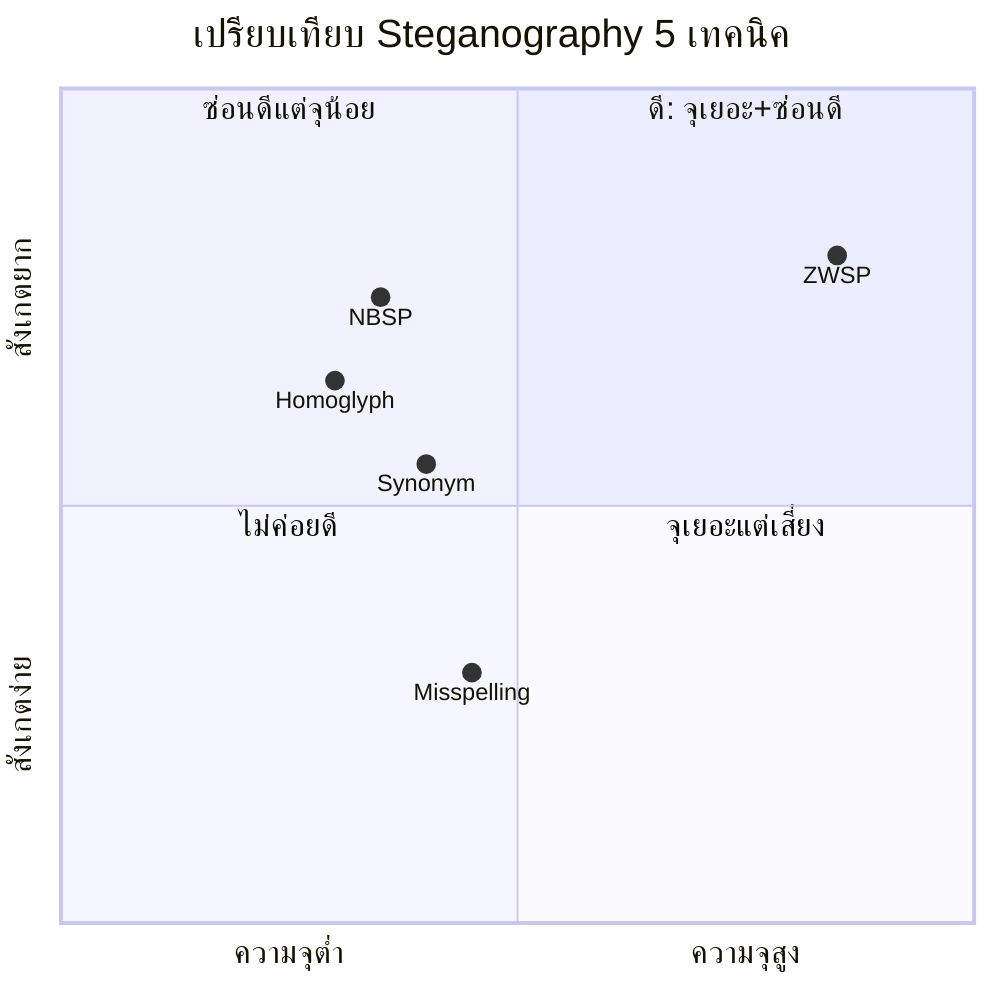

| เทคนิค | ซ่อน bit ด้วย | ความจุ | จุดแข็ง | จุดอ่อน |
|--------|---------------|--------|---------|---------|
| **Homoglyph** | ตัวอักษรคล้าย (ฎ↔ฏ) | ขึ้นกับตัวอักษรในคู่ | ตาเปล่าแยกไม่ออก | ความจุต่ำ ขึ้นกับ covertext |
| **Misspelling** | คำถูก/ผิด (65 คู่) | ขึ้นกับคำในคู่ | เป็นธรรมชาติ (คนสะกดผิดบ่อย) | ผู้อ่านอาจสังเกตคำผิด |
| **ZWSP** | แทรก U+200B | `length - 1` | ความจุสูงมาก มองไม่เห็น | บาง editor ตัด ZWSP ออก |
| **NBSP** | แทนที่ space ด้วย U+00A0 | จำนวน space | ไม่เปลี่ยนจำนวนอักขระ | ความจุขึ้นกับจำนวน space |
| **Synonym** | คำพ้อง (64 กลุ่ม) | ขึ้นกับคำพ้องในกลุ่ม | ข้อความอ่านเป็นธรรมชาติที่สุด | ความจุต่ำ ขึ้นกับ covertext |

---

## 10. Class Diagram

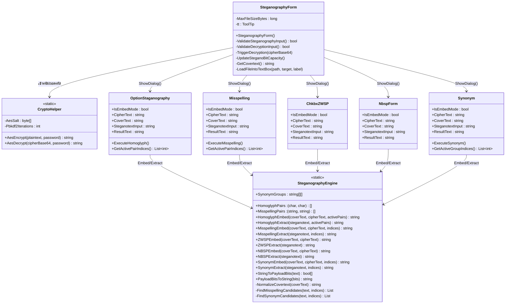

---

## 11. Greedy Search Algorithm (Misspelling & Synonym)

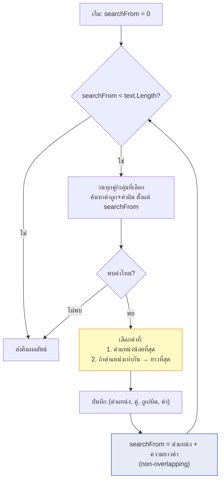
